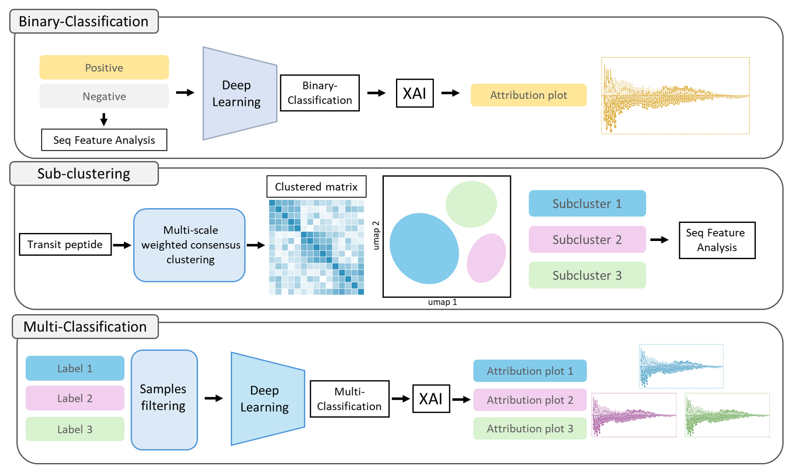

<p align="center">
  
</p>

---------------------------------------
# Deep-cTP-Decipher: Uncovering the Hidden Heterogeneity of Chloroplast Transit Peptides through In-depth Feature Mining

We presents a comprehensive, AI-driven framework to decode the complexity of Chloroplast Transit Peptides (cTPs). By leveraging Deap learning, Explainable AI (XAI) and clustering, the study overcomes the challenges of high sequence heterogeneity to identify distinct, lineage-specific targeting patterns. This framework is sequence-agnostic. It also can be adapted to analyze other signal peptides

## Architecture
 
 The framework consists of three primary components: Binary classification, Sub-clustering, and Multi-classification. See the usage instructions below for details on running the script. Detailed methodology is provided in the paper.

## Install
```sh
git clone https://github.com/brent88310070/Deep-cTP-Decipher.git
cd Deep-cTP-Decipher
```

## Start
### **🌱Part 1: Binary classification & XAI**
### Train a Binary classification CNN model based on your peptide seq data:
```Python
# Binary classification
python -u binary-classify-XAI/model_train_val.py
```
* **Key Parameters**: Please refer to the **Global config** section in `model_train_val.py` for important parameters.
* **Data Note**: Ensure that all **file paths** and **data formats** are correct.
* **Label Customization**: Explanations for `label_1` and `label_2` can be found within the file. You may rename your data columns to match these corresponding column names.
> **Script output**: You will get `Best model` and `df_result.csv` for XAI.


### Model Interpretation and Generate Sequence Attribution:
```Python
# XAI based on Integrated Gradient
python -u binary-classify-XAI/model_interpretability.py
```
* **Key Parameters**: Please refer to the **Global config** section in `model_interpretability.py` for important parameters.
> **Script output**: You will get `Logo_plot.png`.
---


### **🌱Part 2: Sub-clustering**
### Seq sub-clustering using Multi-scale Weighted Consensus Clustering
```Python
# Multi-scale Weighted Consensus Clustering
python -u sub-clustering/subclustering.py
```
* **Key Parameters**: Please refer to the **Global config** section in `subclustering.py` for important parameters.
* **Cluster number**: Defaults to auto-selecting the best Silhouette score for clustering. Use `FIXED_N_CLUSTERS` to manually override the number of clusters.
> **Script output**: You will get `consensus_labels.csv` and two pictures `consensus_silhouette.png`, `consensus_heatmap.png` in folder `result_fig`.


### UMAP: Seq visulization
```Python
# UMAP for the clustered seq
python -u sub-clustering/umap.py
```
* **Key Parameters**: Please refer to the **Global config** section in `umap.py` for important parameters.
* **UMAP config**: It is recommended to experiment with different UMAP parameter combinations to achieve better visualization results. 
> **Script output**: You will get two pictures `umap_by_cluster.png`, `umap_by_species.png` in folder `result_fig`.


### Seq frequency distribution
```Python
# Generate Logo plot & Diff. Heatmap plot
python -u sub-clustering/seq_distribution.py
```
* **Key Parameters**: Please refer to the **Global config** section in `seq_distribution.py` for important parameters.
* **Logo plot**: Calculate seq frequency on Logo plot with different properties color.
* **Diff. Heatmap plot**: Focus on difference between target clusters & other clusters.
* **Note**: You also can apply this script on part 1 by revising the code.
> **Script output**: You will get a series of pictures `logo_cluster_N.png`, `heatmap_cluster_N_difference.png` in folder `result_fig`.

### Seq feature analysis
```Python
# Seq feature analysis for each cluster / class
python -u sub-clustering/seq_feature_analysis.py
```
* **Key Parameters**: Please refer to the **Global config** section in `seq_feature_analysis.py` for important parameters.
* **SPARROW**: The analysis is based on package [SPARROW](https://github.com/idptools/sparrow). You must to clone the repo for this script.
* **Note**: There are two kinds of plots: `Box plot` for global features & `Curve profile` for local features.
> **Script output**: You will get a series of predicted pictures in folder `seq_feature_fig`.

### **🌱Part 3: Multi-classification & XAI**
### Filter sample to extract core samples
```Python
# Extract core samples
python -u multi-classify-XAI/extract_core_sample.py
```
* **Key Parameters**: Please refer to the **Global config** section in `extract_core_sample.py` for important parameters.
* **Note**: Get core samples for better performance in Multi-classification.
> **Script output**: You will get `consensus_labels_core.csv` & `silhouette_distribution.png`.

### Train a Multi-classification CNN model based on your peptide seq data:
```Python
# Multi-classification
python -u multi-classify-XAI/model_train_val.py
```
* **Key Parameters**: Please refer to the **Global config** section in `model_train_val.py` for important parameters.
* **Data Note**: Ensure that all **file paths** and **data formats** are correct.
* **Class num. Note**: Must check your `NUM_CLASSES` based on your cluster num.
> **Script output**: You will get `Best model`, `confusion_matrix.png` and `df_result.csv` for XAI.

### Model Interpretation and Generate Sequence Attribution:
```Python
# XAI based on Integrated Gradient
python -u multi-classify-XAI/model_interpretability.py
```
* **Key Parameters**: Please refer to the **Global config** section in `model_interpretability.py` for important parameters.
> **Script output**: You will get a series of `Cluster_N_logo.png` in folder `ig_plots`.
---